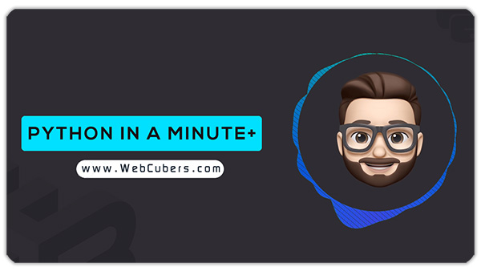

# Python in a Minute

This repository is related to the "Python in a Minute" training series.

You can download examples and use them to improve your coding skills.

If you have any questions or suggestions, please email Socials@WebCubers.com.

Youtube : https://www.youtube.com/channel/UCDRQquM1vBghN8n5dcf9-CA

Instagram : www.instagram.com/WebCubers

Website : www.WebCubers.com